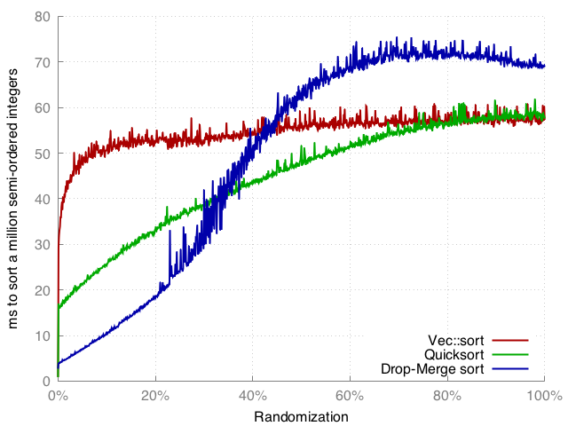
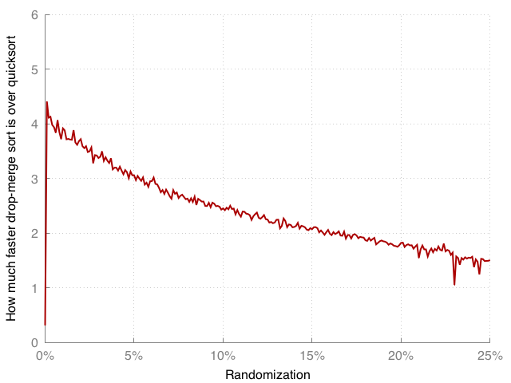

# Abstract
This is an implementation of a novel [adaptive sorting](https://en.wikipedia.org/wiki/Adaptive_sort) algorithm optimized for nearly-sorted data. Drop-Merge sort is especially useful for when >85% of the data is already in-order, and the unsorted elements are evenly distributed. An example use-case would be re-sorting an already sorted list after minor modifications.

Drop-Merge sort is 2-4 times faster than quicksort in cases where >95% of the data is already in order, while being considerably simpler to implement than other adaptive sorting algorithms.

With `N` elements in the list where `K` elements are out-of-order, Drop-Merge sort performs `O(N + K⋅log(K))` comparisons and use `O(K)` extra memory.

# Background
The paper [Item Retention Improvements to Dropsort, a Lossy Sorting Algorithm](http://micsymposium.org/mics_2011_proceedings/mics2011_submission_13.pdf) by Abram Jackson and Ryan McCulloch introduced improvements to the esoteric "lossy" sorting algorithm known as [*Dropsort*](http://www.dangermouse.net/esoteric/dropsort.html). In Dropsort, out-of-order elements are simply "dropped" (i.e. removed). In the paper, Jackson et al. introduced improvements to Dropsort which improved the detection of out-of-order elements so that more elements would be kept, and fewer dropped.

Although the paper does not spell it out, it does in fact describe a fast `O(N)` algorithm for finding an approximate solution to the [Longest Nondecreasing Subsequence](https://en.wikipedia.org/wiki/Longest_increasing_subsequence) (LNS) problem. The algorithm is very effective when a majority of elements in a list is in order (part of the LNS).

Example input, where most of the data is in order:


# Drop-Merge sort
The main idea in Drop-Merge sort is this:

* Use the methods described in the Jackson et al. paper to find the Longest Nondecreasing Subsequence (LNS).
* Keep the LNS and drop the outliers into a separate list.
* Sort the list of dropped outliers using a standard sorting algorithm (such as quicksort).
* Merge the outliers back into the main list of the already sorted LNS.

Thus despite its heritage, Drop-Merge sort is a *lossless* sorting algorithm (the normal kind).

# Finding the Longest Nondecreasing Subsequence
The implementation uses the idea of *memory* from the Jackson et al. paper to detect *mistakes* - elements that probably should have been dropped instead of accepted. Consider the following sequence of numbers:

`0 1 12 3 4 5 6 7 8 9`

The naïve Dropsort algorithm will accept `0 1 12` and then drop the remaining values (as they are all smaller than 12). The idea of memory is to detect when we have dropped a certain number of elements in a row. When this happens, we roll-back and drop the last element before the long run of drops. This is a form of back-tracking which solves the above problem. In the case of the input above, the algorithm will drop the `12` and keep all other elements. In this implementation, we consider the dropping of 8 elements in a row to be the cutoff point at which we roll-back and undo. This contains the assumption that there will be no more than 8 outliers in a row. It is a very simple method that works well in practice.

Drop-Merge sort will keep in-order elements in situ, moving them towards the start of the list. This helps keep the memory use down and the performance up.

# Performance
To test the performance of this algorithm, I generate almost-sorted data like this (pseudo-code):

```
function generate_test_data(length, randomization_factor) -> Vec {
	result = Vec::new()
	for i in 0..length {
		if random_float() < randomization_factor {
			result.push(random_integer_in_range(0, length))
		} else {
			result.push(i)
		}
	}
	return result
}
```

Comparing this to the default Rust sorting algorithm ([Vec::sort](https://doc.rust-lang.org/beta/std/vec/struct.Vec.html#method.sort), a [stable sorting algorithm](https://github.com/rust-lang/rust/pull/38192)) and [dual-pivot quicksort](https://github.com/notriddle/quickersort) for different randomization factors. The compiler was `rustc 1.15.0-nightly (71c06a56a 2016-12-18)`.



We can see that all three algorithms manages to exploit almost-sorted data, but Drop-Merge sort wins out when the randomization factor is less than 25% (more than 75% of the elements are in order). It also behaves well when the data becomes more random, and even when the input data is fully random it is only ~30% slower than quicksort.

Here is another view of the data for 0-25% randomization:



Here we can see that we get 4x speedup over quicksort when 99% of the elements are in order, and a 2x speedup when 90% of the elements are in order.

# Comparison to other adaptive sorting algorithms
An adaptive sorting algorithm is one that can exploit existing order. These algorithms ranges from the complicated to the simple.

On the complicated end there is the famous [Smoothsort](https://en.wikipedia.org/wiki/Smoothsort), which seems, however, to be quite unpopular - probably due to its complexity. I failed to find a good implementation of Smoothsort to compare Drop-Merge sort against. [Timsort](https://en.wikipedia.org/wiki/Timsort) is a more modern and popular adaptive sorting algorithm. It needs long spans of nondecreasing elements to compete with the performance of Drop-Merge sort. The standard Rust sort uses a variant of Timsort, and as you can see from the performance comparisons, Drop-Merge sort wins for the nearly-sorted cases for which it was designed.

On the simple end of the spectrum there are `O(N²)` algorithms that perform extremely well when there are only one or two elements out of place, or the list is very short (a few hundred elements at most). Examples include [Insertion sort](https://en.wikipedia.org/wiki/Insertion_sort) and [Coctail sort](https://en.wikipedia.org/wiki/Cocktail_shaker_sort).

Drop-Merge sort finds an interesting middle-ground – it is reasonably simple (around 50 lines of code), yet manages to perform well for long lists. Note, however, that Drop-Merge sort depends on another sorting algorithm (e.g. quick-sort) for sorting the out-of-order elements.

# Limitations and future work
Drop-Merge sort is not stable, which means it will not keep the order of equal elements.

Drop-Merge sort does not sort [in-situ](https://en.wikipedia.org/wiki/In-place_algorithm), but will use `O(K)` extra memory, where `K` is the number of elements out-of-order.

There is a worst-case scenario where all elements are in order, except for the last few who are smaller than all the preceding ones. In this case the algorithm will back-track and drop all the initial elements and keep only the last. The behavior of this is still `O(N⋅log(N))` comparisons, but it will use `O(N)` extra memory and be around 6x slower than the standard Rust sort. We could potentially improve this by detecting large back-tracking and handle it by either simply stopping the back-tracking, or maybe by dividing the input at the problem boundary and recursing, before finally merging the sorted sub-ranges.

The algorithms uses `recency=8` which means it can handle no more than 8 outliers in a row. This number was chosen by experimentation, and could perhaps be adjusted dynamically for increased performance.

Another improvement would be to detect cases where the input is does not conform to the working hypothesis of being partially-sorted.
